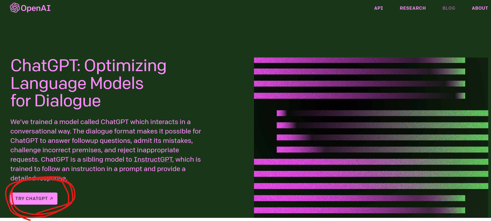
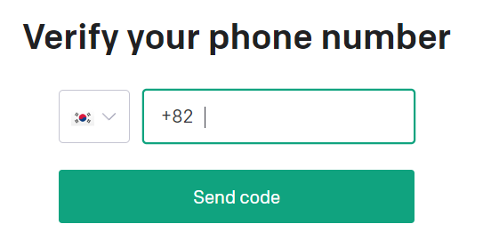
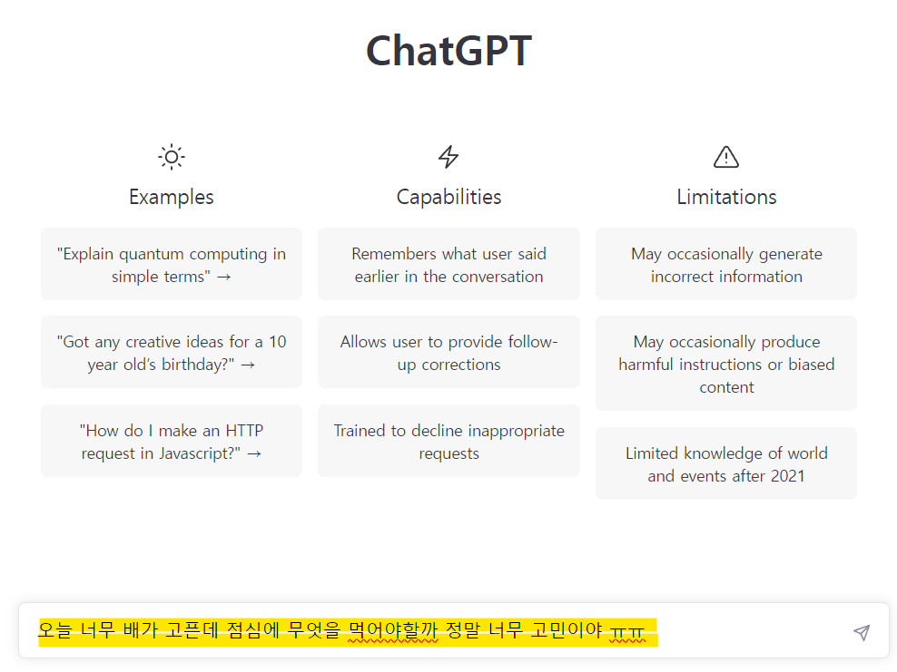
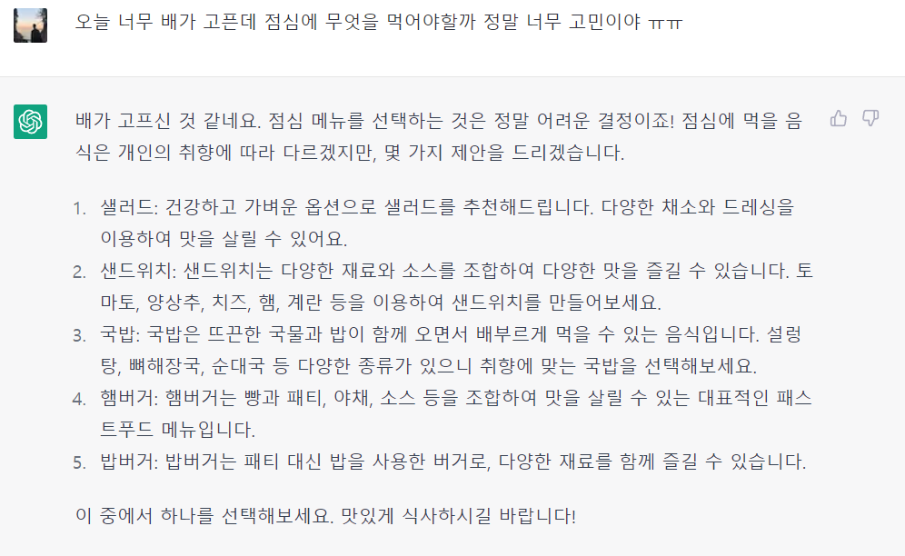
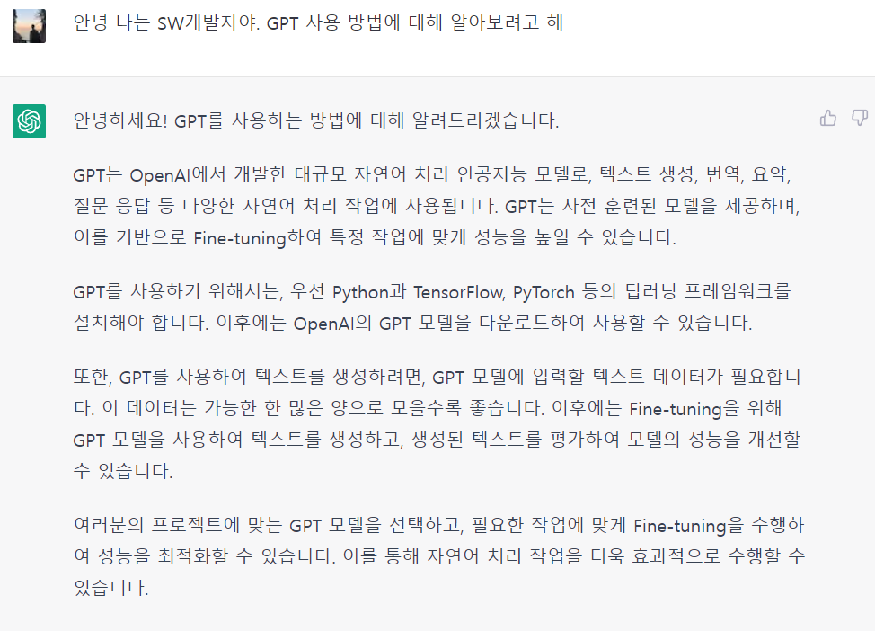
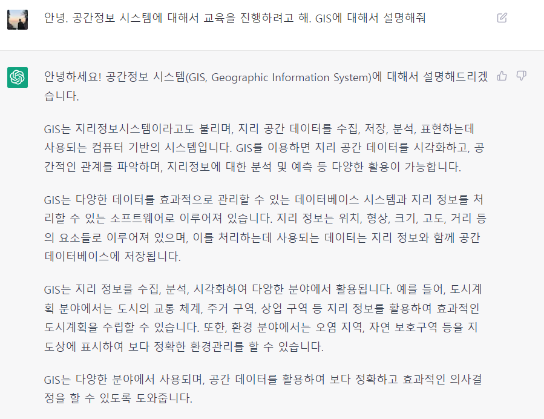
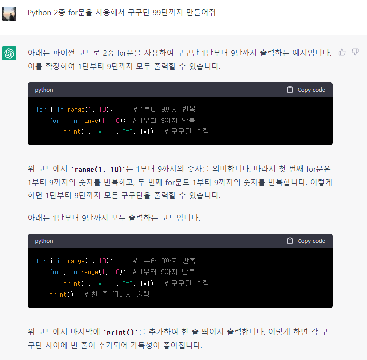

# 챗GPT(chatGPT)란?
- 챗GPT는 내 질문에 답변해 주는 인공지능 채팅 서비스
- 테슬라의 일론 머스크, 와이콤비네이터 창업자인 샘 알트만, 링크드인 공동창업자인 리드 호프먼 등 IT업계의 거물들이 뭉쳐 설립한 세계 최대의 인공지능 연구소인 오픈AI 사에서 개발
- 작동방식은 여타의 챗봇과 유사
- 성능
    - 특정 주제를 던져놓고 글의 개요를 짜달라고 할 수도 있고, 긴 분량의 글을 요약해달라고 요청할 수도 있음. 상황을 설명하면 이메일도 써줌.
    - 코드를 짜달라고 요청할 수도 있음. 이 모든 일들을 즉시 해냄.
    - **구글 등 기존의 검색 서비스가 정보를 보여주는 대서 그쳤다면, 챗GTP는 정보를 순식간에 정제된 텍스트로 만들어줌.**\

- 단점
    - chat-GPT의 답변을 아직 완벽히 신뢰할 수 없음. **2021년까지의 지식까지만 학습했기에 그 이후에 일어난 일에 대해선 부정확한 정보를 알려줄 확률이 높음** 
    - 실시간으로 정보를 찾는 것도 아니기 때문에 현재 상황에 맞는 정보를 제공할 수도 없음

- 장점
    - 가치중립적인 정보의 검색과 정리, 문서화는 순식간에 해냄. 매우 유능한 AI 비서

- **2023년 2월 기준으론 간단한 회원 가입만 하면 무료로 사용 가능.**
- 유료 버전인 '챗GPT 플러스'도 출시되었는데, 월 20달러(약 2만5400원)을 내면 이용자가 집중되는 피크타임에도 평소처럼 접속하고, 질문에 대한 답변을 빨리 받을 수 있음.

# 챗 GPT(chatGPT) 사용법

## 챗GPT(chatGPT) 회원가입하기
1.  Chat-GPT링크로 이동
    - [**챗GPT 바로가기👉 https://openai.com/blog/chatgpt/**](https://openai.com/blog/chatgpt/)

2. 왼쪽 하단의 TRY CHAT-GPT를 클릭

3. sign up 버튼 클릭
    - 구글이나 마이크로소프트 계정으로 로그인 가능

4. 이름과 전화번호를 입력

5. 로그인이 완료된 화면이다. 아래에 form에서 질문을 입력하는 방식으로 일을 시켜준다.

6. 답변 예시

## 챗GPT 질문(프롬프트)입력 팁

### 영어로 질문하세요
- 챗GPT는 기본적으로 영어로 세팅
    - 한글 사용 가능하지만 답변 속도가 느리고 정보량이 부족

### 상황을 구체적으로 설명하세요
- 구체적인 배경과 목적을 설명
    - 예시) `‘API를 설명해줘’`라고 입력하는 것보단, `‘나는 코딩 교육 스타트업의 마케터야. 중학생을 대상으로 API의 개념을 설명하는 자료를 만들어줘. 5단락 정도 되면 좋겠고, 구체적인 예시를 2개 이상 들어줘’`라고 입력하는게 활용도 높은 답변 받음
- 챗GPT는 대화의 맥락을 기억함. 원하는 답을 얻을 때까지 비슷한 질문을 반복해서 사용

### 챗GPT에게 역할을 부여해 보세요
- 챗GPT에게 역할을 부여한 다음 대화를 이어나가 보자.
    - 예시) `'코딩 교육 스타트업의 마케팅 팀장처럼 행동해 줘. 네가 질문을 하면 내가 대답을 할게. 첫 번째 질문은 알아서 생성해 줘.'`
- 실제로 미국의 온라인 매체 버즈피드는 맞춤형 퀴즈 제작에 챗GPT를 활용할 계획이라고 함
- 이처럼 챗GPT의 기능을 본인들의 서비스에 적극적으로 접목시키려는 시도가 활발

# 챗GPT(chatGPT) 활용 방법
## 직장인을 위한 챗GPT 활용법(기획안 작성, 이메일, 요약, 아이디어 도출, 콘텐츠 제작 등등 )
- 챗GPT를 사용하면 업무 효율성을 대폭 올릴 수 있음

- 질문하기

- 교육자료 찾기 

- 코딩하기 (내가 질문을 잘 못한듯 하다)
